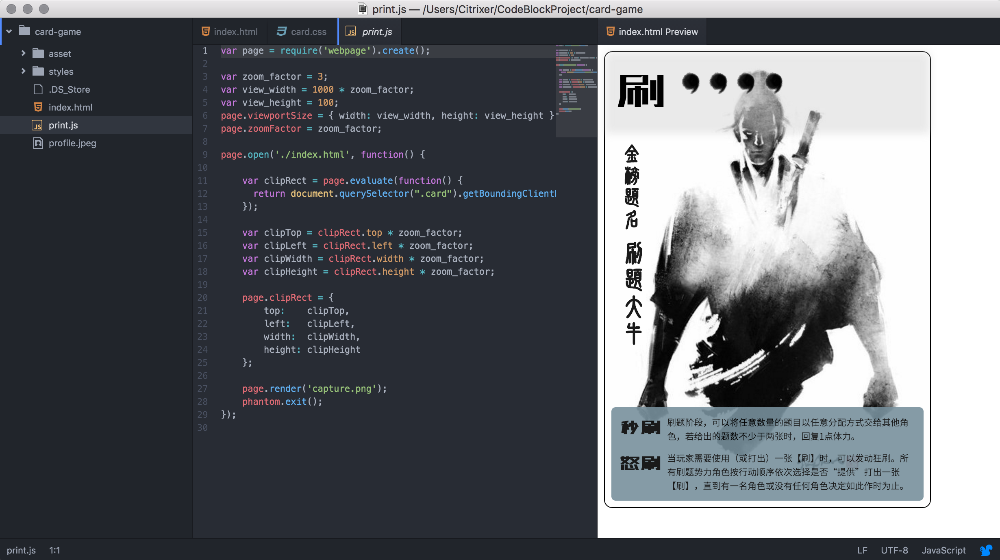

# 人物卡牌生成器
利用`PhantomJS`来生成三国杀风格的人物卡牌。



## 使用说明
```bash
npm install
node automation.js
```

把图片和描述人物的JSON文件放到`./data/`中，图片名字必须为JSON文件中的`id + .jpg`。

### 例子
`./data/`中有`zhangsanfeng.json`和`zhangsanfeng.jpg`。 其中JSON文件内容如下：

```
{
  "id": "zhangsanfeng",
  "clan": "武当",
  "blood_number": "4",
  "nickname": "一代宗师",
  "name": "张无忌",
  "skills_group": [
    {
      "title": "突袭",
      "description": "摸牌阶段，可以放弃摸牌，然后从至多两名（至少一名）角色的手牌里各抽取一张牌。"
    },
    {
      "title": "铁骑",
      "description": "当使用【杀】指定一名角色为目标后，可以进行判定，若结果为红色，此【杀】不可被闪避。"
    }
  ]
}
```

## FAQ
Q: 会制作一个GUI方便大家使用吗？
A: 没空。

Q: 中文字体能够商用么？ A: 可以。

Q: 可以修改主题吗？ A: 可以，自己弄。

## License
MIT
